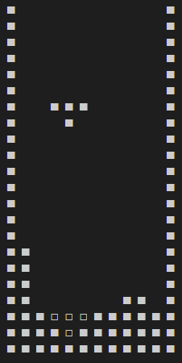

# コンソールゲーム　～テトリス～


## 実行方法
推奨環境：Linux
```
mkdir build && cd build
cmake ..
make
```
## 遊び方
- A：←
- D：→
- S：ソフトドロップ
- w：ハードドロップ
- Space：回転

## 参考サイト
https://qiita.com/Chomolungma/items/52bd8b133b747cb603e7
